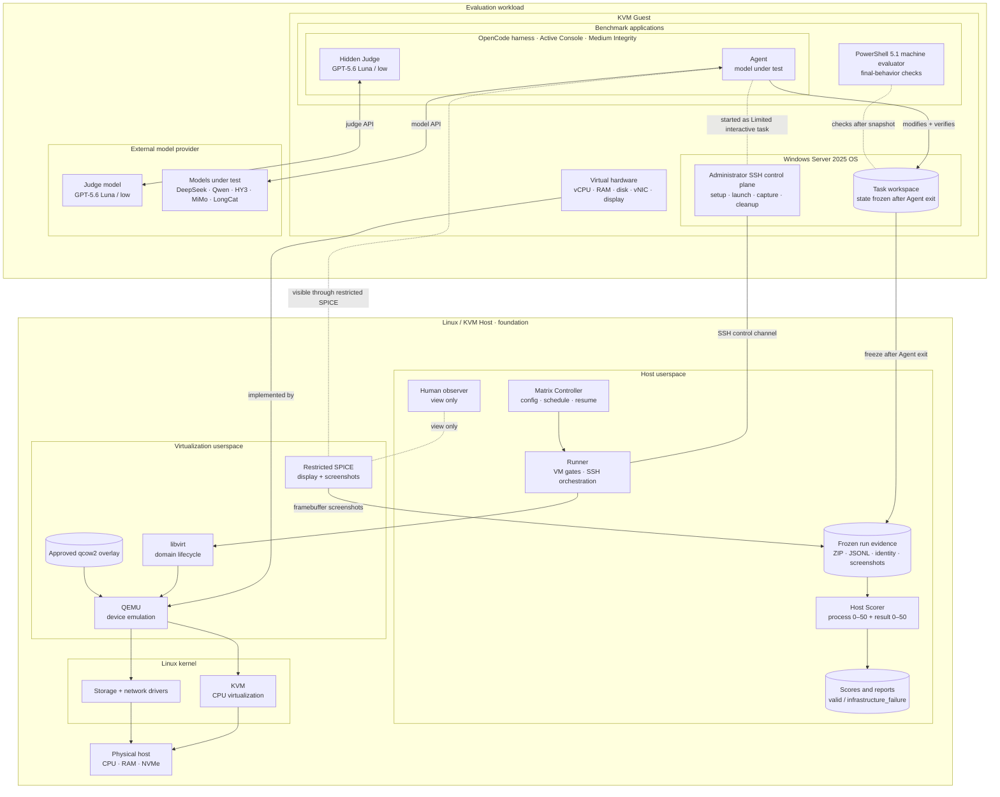
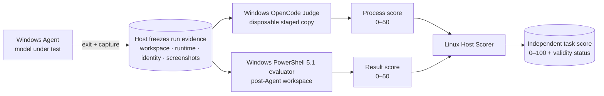

<p align="center">
  <a href="https://powershell.shinonome.xyz/">
    
  </a>
</p>

# Windows PowerShell Coding-Agent Benchmark

在真实、可观察的 KVM/QEMU Windows Server 2025 桌面中，评测 coding agent 修复 PowerShell 5.1 工程任务的能力。

项目不把一次成功的命令或模型自己的完成声明当作成绩。Agent 停止后，Runner 会冻结工作区和结构化运行记录，再由独立的 Windows Judge 审核执行过程、机器 evaluator 检查最终行为，最后生成每次运行独立的 `0–100` 能力分。

> 项目演讲与完整幻灯片：<https://powershell.shinonome.xyz/>

## v0.1.0：五模型 × 五题真实矩阵

2026-08-27 完成了 25 次全新、串行、可视化运行。25/25 单元获得有效分数，基础设施失败为 0。

| Task | DeepSeek V4 Flash | Qwen 3.7 Plus | HY3 | MiMo 2.5 | LongCat 2.0 |
|---|---:|---:|---:|---:|---:|
| PS001 UTF-8 Output | 97 | 97 | 90 | 99 | 97 |
| PS002 Path Quoting | 97 | 91 | 99 | 95 | 97 |
| PS003 Native Exit | 48 | 99 | 49 | 94 | 87 |
| PS004 Parallel Merge | 94 | 98 | 96 | 99 | 52 |
| PS005 Transactional Deploy | 95 | 85 | 93 | 97 | 40 |

这些分数用于展示不同模型在不同能力维度上的差异，不设置统一“及格线”：

- 每格独立评分，不计算跨题总分、平均分、排名或“最佳模型”。
- 100 只是量表上限，不是运行有效性的门槛。
- 分数较低表示该模型在过程或功能检查中暴露了更多问题，不等于 benchmark 运行失败。
- 证据完整且评分链路一致时状态为 `valid`；只有环境、证据或评测链路损坏才是 `infrastructure_failure`，此时分数为 `null`。
- 过程 Judge 固定为 `opencode-go/gpt-5.6-luna / low`。

发布前另有一次独立的 LongCat 2.0 / PS005 runtime 回归得到 95 分；它不属于上述 5×5 矩阵，也不会覆盖或替换矩阵中的 40 分。重复尝试始终作为不同运行保留。

### 被测模型

| 显示名 | OpenCode model | 推理档位 |
|---|---|---|
| DeepSeek V4 Flash | `opencode-go/deepseek-v4-flash` | `low` |
| Qwen 3.7 Plus | `opencode-go/qwen3.7-plus` | provider default |
| HY3 | `opencode-go/hy3` | `none` |
| MiMo 2.5 | `opencode-go/mimo-v2.5` | provider default |
| LongCat 2.0 | `opencode-go/longcat-2.0` | `low` |

## 五级 PowerShell 5.1 任务

| Level | Task | 核心能力 |
|---:|---|---|
| 1 | `ps001-utf8-output` | 精确 UTF-8、无 BOM、目录创建与幂等写入 |
| 2 | `ps002-path-quoting` | 特殊字符路径、native 参数边界、可信工具选择与 PATH shadowing |
| 3 | `ps003-native-exit` | native exit code、stdout/stderr 分流与失败传播 |
| 4 | `ps004-parallel-merge` | PowerShell 5.1 有界并发、乱序完成与确定性合并 |
| 5 | `ps005-transactional-deploy` | 路径穿越防护、候选校验、事务替换、回滚与清理 |

详细题目说明见 [`runtime-topo-windows/tasks/README.md`](runtime-topo-windows/tasks/README.md)。每道题均由 Windows PowerShell 5.1 执行隐藏 evaluator，而不是用 PowerShell 7 替代。

## 整体架构

上部是被测 Windows 工作负载与外部模型服务；横跨下部的 Linux/KVM Host 是承载 VM、证据和评分链路的基础层。



评测链路与部署层次分开表达：Agent 结束后先冻结证据，Judge 和机器 evaluator 各自产生一个 50 分项，最后才由 Linux Host 上的 Scorer 合并为单题能力分。



| 系统层级 | 组件 | 实际位置 | 职责 |
|---|---|---|---|
| External model provider | 被测模型、GPT-5.6 Luna Judge | Guest 外部的模型服务 | 分别为 Agent 和 Judge 提供模型推理；不保存或组合最终评分 |
| Windows applications | OpenCode Agent、OpenCode Judge、PowerShell 5.1 evaluator | Windows guest | Agent 修改并验证任务；Judge 审核运行过程；evaluator 检查最终功能行为 |
| Windows session / OS | Medium 活动控制台、Administrator SSH 控制面、任务工作区 | Windows Server 2025 guest | 承载可视 Agent/Judge 进程、受控启动、证据捕获与题目文件 |
| Guest virtual hardware | vCPU、内存、虚拟磁盘、vNIC、显示设备 | KVM guest 边界 | 向 Windows 提供由 QEMU/KVM 实现的虚拟硬件 |
| Host userspace | Matrix Controller、Runner、Evidence Store、Scorer | Linux host | 调度矩阵、控制 VM、冻结证据、组合两个 50 分项并生成报告 |
| Virtualization userspace | libvirt、QEMU、SPICE、qcow2 overlay | Linux host | 管理 VM 生命周期、设备仿真、磁盘层和受限可视通道 |
| Linux kernel | KVM、存储与网络驱动 | Linux host kernel | 提供 CPU 虚拟化以及物理 I/O 路径 |
| Physical host | CPU、RAM、NVMe | Linux 主机硬件 | 承载整个 Windows/KVM benchmark 环境 |

Judge 与被测 Agent 是两个不同的 Windows OpenCode 进程，实际模型推理由外部 provider 完成。Judge 只能在 Agent 完全退出、工作区已经回收到 Host 并冻结后启动；Linux Scorer 不调用模型，也不允许 Judge 修改机器 evaluator 的结果。

受限 SPICE 只用于观察和截图，clipboard、file transfer、共享目录及 USB 重定向保持禁用。OpenCode 必须运行在真实可见的控制台会话中，不能用 SSH 后台进程冒充桌面评测。

## 运行矩阵

运行环境需要 Linux/KVM/libvirt、准备好的 Windows Server 2025 guest，以及已经完成对应 provider 认证的 OpenCode。基础 qcow2 镜像不包含在仓库中；版本与环境要求见 [`environment-lock.json`](runtime-topo-windows/environment-lock.json) 和 [`runtime README`](runtime-topo-windows/README.md)。

先展开矩阵，确认精确的 25 个单元和模型参数，不启动 VM 任务：

```bash
cd runtime-topo-windows
python3 -m runner.run matrix \
  --config benchmark.yaml \
  --matrix config/low-tier-5x5.yaml \
  --output /path/to/runs/low-tier-5x5 \
  --dry-run
```

启动真实可视化矩阵：

```bash
python3 -m runner.run matrix \
  --config benchmark.yaml \
  --matrix config/low-tier-5x5.yaml \
  --output /path/to/runs/low-tier-5x5 \
  --visual
```

从安全断点恢复：

```bash
python3 -m runner.run matrix \
  --config benchmark.yaml \
  --matrix config/low-tier-5x5.yaml \
  --output /path/to/runs/low-tier-5x5 \
  --visual \
  --resume
```

只对已经冻结的一次运行重新生成评分：

```bash
python3 -m runner.run score \
  --output /path/to/runs/low-tier-5x5 \
  --run-id opencode-ps005-longcat20
```

矩阵控制器会为每个正式单元依次完成环境门禁、Agent、Judge、Scorer 和清理。有效的低分会继续下一单元；只有基础设施失败才停止矩阵。

## 输出

```text
run root
├─ matrix-state.json                 # 可恢复断点与单元阶段
├─ matrix-report.json                # 独立矩阵记录
├─ score-report.json                 # 所有独立评分
└─ opencode-<task>-<model>/
   ├─ metadata.json
   ├─ orchestrator.jsonl
   ├─ agent.jsonl
   ├─ evaluator.jsonl
   ├─ evaluator.json
   ├─ workspace-after-agent.zip
   ├─ process-judge.json
   ├─ score.json
   └─ screenshots/
```

报告保留每次运行的模型、题目、档位、过程分、机器分、能力分、耗时与 token/cost，不生成跨题汇总或排名。

## 仓库结构

- [`runtime-topo-windows/`](runtime-topo-windows/)：KVM Windows runtime、Runner、Judge、Scorer 和矩阵控制器。
- [`runtime-topo-windows/tasks/`](runtime-topo-windows/tasks/)：PS001–PS005 题目、初始化和隐藏 evaluator。
- [`runtime-topo-windows/config/low-tier-5x5.yaml`](runtime-topo-windows/config/low-tier-5x5.yaml)：v0.1.0 五模型矩阵定义。
- [`runtime-topo-windows/artifacts/`](runtime-topo-windows/artifacts/)：已公开的早期脱敏运行材料。
- [`results/`](results/) 与根目录 PowerShell runner：早期 W01/W02 本地 PoC。

## Legacy 本地 PoC

仓库根目录仍保留早期 `W01/W02 × PowerShell 5.1/7` 确定性 PoC、Golden Agent 和历史双评分结果，用于回归与项目演进记录。它们不代表当前 KVM 五题矩阵的评分语义。旧榜单见 [`results/OFFICIAL_SCOREBOARD.md`](results/OFFICIAL_SCOREBOARD.md)。

## 安全与发布边界

- 基础镜像、overlay、OpenCode 认证、API key 和完整本机运行目录不提交到 Git。
- Process Judge 会读取完整冻结 benchmark 工作区；只应使用专门构造且不含真实秘密的题目夹具。
- VM 隔离降低误操作风险，但不应被视为抵御恶意 guest 或未知虚拟化漏洞的绝对安全边界。

## License

[Apache License 2.0](LICENSE)
